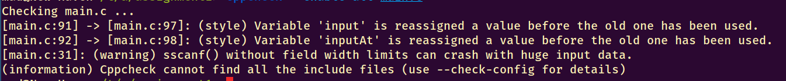
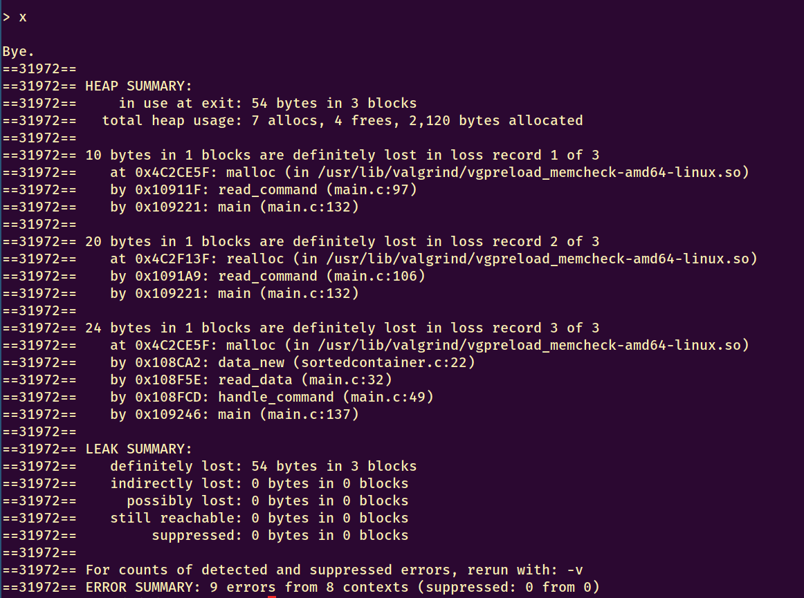
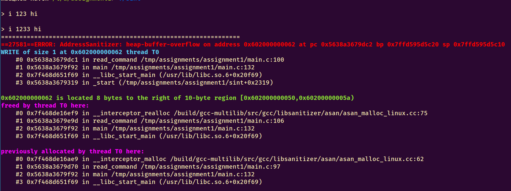

# Approach
I decided to start from the library (sortedcontainer) beginning with the most low-level functions, working my way towards the more complex ones.

I initially tried all of the following debuggers on the original codebase, and then I modified each file individually.
Once a file was modified, I would test it using the command line (for scanf errors and tree printages), the `test.c` file, the `3.expect` file and further ad-hoc C test files useful for isolating difficult code.

All test runs were also checked by Address Sanitizer, as code was compiled by default using it, which provided good error checks.
Due to my experience with C, careful program editing (rather than frequent compilations), and separate function testing (in the ad-hoc test files) I never obtained any errors with Address Sanitizer during development. Only after having written all of the code, did Address Sanitizer identify one missing memory leak in the `main()` function.

## Cppcheck

Cppcheck is a simple tool that can help find memory leaks and other simple C library usage errors.
The command that was used is `cppcheck --enable=all <file>`

The files _sortedcontainer.c_ and _sortedcontainer.h_ appeared to contain no errors.
The following errors were found:

- _sortedcontainer.h_: none
- _sortedcontainer.c_: none
- _main.c_:
    - `(warning) sscanf() without field width limits can crash with huge input data`: maximum field sizes must be applied to scanf's format string in order to avoid buffer overflows.

Overall, cppcheck was not too useful in finding bugs.
This does not exclude the usefulness of the program in different settings; in fact, it proved to be a powerful ally while scanning for concrete security bugs in other open source projects.

## Valgrind
{height=350}

Valgrind is a well known debugging tool, often used to check for heap usage errors and memory leaks.
The command used to detect errors was `valgrind --leak-check=full  --show-leak-kinds=all --track-origins=yes`.

The following errors were found:

- `read_data()` contains uninitialized variables: this issue can easily be checked, but is not a security problem in that specific case, as the variables are initialized by `sscanf()`.
- invalid reads in `read_command()` when inserting long commands: this is similar to the `inputAt` heap overflow from Address Sanitizer, yet it is detected during the loop's two break conditions (so not as early as ASan).
- the same leak in `handle_errors()` as found by ASan.
- the same `data_new()` leak as found by ASan, while executing `t`.
- the same `sortedcontainer_new()` leak as found by ASan, while executing `t`.

Overall, valgrind is a very helpful tool, but fails to check many of the more subtle memory errors in a program.

## Address Sanitizer (ASan)

ASan is an open-source tool developed by Google. It is often capable of finding more memory leaks and buffer overflows than valgrind (especially for stack smashing) and is so well regarded that it has been integrated into `gcc` and `clang`.

To enable it for gcc, the following flag is added to the make file's `CFLAGS`: `-fsanitize=address`.

The binary is then injected with code capable of providing information regarding bugs when they happen or when the program crashes.

It is important to notice that **a sanitized program cannot also be analyzed by valgrind!**

The following errors were found:

- heap buffer overflow in `read_command()` during command `"i 123 hello"`: 

    the `input` buffer allocated by `malloc()` and freed by `realloc()` appears to have been overflown by `inputAt[incr - 1] = 'e'`, leading to a crash. This is because `inputAt` is not updated to the new address set by `realloc()`, and is effectively overflowing old buffers on the heap. This error occurs only when inserting commands of at least 10 bytes (including the newline), since the buffer is reallocated only when then input is larger than 10 characters.
- memory leak in `read_command()` during command `x`:

    10 bytes were leaked from the `input`buffer allocated by `malloc()`. This is probably due to the fact that upon error the function forgets to deallocate that data (in `fgets()`), but could also be due to a caller function making the same mistake.
- memory leak in `sortedcontainer_new()` after command `"t"` and `"x"`:

    8 bytes were leaked from a function that only allocated data, which was leaked only upon program exit. This is likely because the delete function had not yet been implemented, and the sortedcontainer struct (containing a 64bit pointer) was never deallocated.
- memory leak in `data_new()` after command `t` and `x`:

    24 bytes leaked. This is similar to the previous error (`data_delete()` has been implemented but not `node_delete()`) and in fact the data structure is 24 bytes long on my system.
- memory leak in `read_command()` after command `"p"`,`"t"` and `"x"`:

    30 bytes leaked. This leak recalls the first one, where we learned 10 bytes is the `input` buffer limit to avoid crashing the program. The three commands were short enough and were all executed correctly, this hints that the program may not be deallocating commands that were previously successfully handled.
- memory leak in `handle_command()` after two erase commands and `"x"`:

    48 bytes leaked (ignoring leaks for previously executed commands) while calling `sortedcontainer_erase()` with the leaked data. This leak stems from `data_new()`, but unlike the previous one, this happens within _main.c_ and not _test.c_. There isn't a call to `data_delete()` in the whole file, which means that there is no deallocation of that data in `handle_command()` after usage.

Address sanitizer was incredibly helpful in finding new bugs, and is capable of providing information that is more useful and readable compared to valgrind. Overall, I used this tool quite often (since it works transparently) and after development it helped me realize I had forgotten to free the read buffer after receiving each input in the main loop.

# Results
While _sortedcontainer.c_ contained very few bugs, _main.c_ was a very unsafe program which contained many common and more subtle programming errors.

The main characteristics for these bugs (and their solutions) are reported here, though the reader is encouraged to check the documentation comments in the program for a much more detailed explanation.

## _sortedcontainer.c_
In order to achieve improved maintainability, inputs for all library functions were considered valid. This behaviour is similar to most C standard functions and proved to be useful when trying to isolate control flow bugs (occurring primarily in _main.c_).

The following security bugs were found:

- heap smashing in `data_new()`:

    while copying the string to initialize, there was no insertion of a string terminator. This bug could lead to a future buffer overflow on the heap, which could lead to shell code execution following a `free()` to that area as first detailed by security researcher Solar Designer[^phrack] during exploitation of Netscape `4.73` in 2010.
- variable initialization in `node_new()`:

    care was taken to always initialize values when allocating new data, and `node_new()` is no exception. While this is not usually an issue by itself and errors will not occur when the data is handled carefully, it is a healthy hardening technique commonly adopted by most programmers and can prevent nasty vulnerabilities such as data leaks.

On a side note, when developing `sortedcontainer_contains()`, `sortedcontainer_erase()`, and `sortedcontainer_insert()` I noted a common core to these functions. I then favored modularity and code cleanliness when making a new function `sortedcontainer_index()` capable of searching in the container and returning pointers both to the found node (or "free spot", when no match was found) and its pointer's position in memory. This practice was very effective in producing bug-free code, since those 3 functions are the main bulk of the library.

Furthermore, for testing purposes, it should be noted that when deleting a node from the tree its left child was always promoted before its right one.

[^phrack]: http://phrack.org/issues/57/9.html

## _main.c_
The main challenge of this file resulted in fixing bugs without altering too much the code structure, by making use of minimal edits.
This proved to be most true for functions `read_command()` and `read_data()`, where I was very limited by implementation choices (such as `sscanf()` and the reading loop).

While the code documentation for each function provides extensive insight into each bug found and applied fix, this section will try to briefly summarize those concepts:

- `read_data()`: 

    The main issues in this function dealt with incorrect usage of `sscanf()` and insufficient understanding of format string syntax. No only was there a possibility for integer and buffer overflows, but the specification was not completely respected (negative ages were accepted). 
    
    In order to fix these issues, the specification needed to be tighened and a more robust format string had to be devised (with much much effort), which closely mimicked the following (extended) regular expression: `^[iec]\s+[0-9]{1,10}\s+[a-zA-Z]{1,19}\s*$`. 
    
    The parsing of that expression was checked for matching failures and other errors, such as excess garbage towards the end of the command, or byte injections. All fields were restricted by size in order to prevent overflows, including the numeric field. This effectively limits the maximum possible accepted age to $2^{31}-1$, yet this number was never fixed in the specification, and it would be difficult (maybe not even possible) to prevent integer overflows using `sscanf()` without such a fixed limit.
- `handle_command()`:
    
    The most important security issue with this function was a data leak due to a `fprintf()` of user input as format string. The attacker could use this to his advantage and pop values off the stack at his command, which could prove to be a very powerful gadget during ROP chaining in an ASLR context. Furthermore, the generic lack of error checking (such as data initialization) and ownership tracking could easily lead to memory leaks.
- `read_command()`:

    Arguably the most insecure function of the whole program, this code required a lot of careful inspection. 
    
    The easiest bugs to detect were the missing checks for dynamic allocations in `malloc()` and `realloc()`, which could lead to memory leaks or NULL pointer derefences. Secondly, the data reallocation was not correctly handled: not only would the `inputAt` variable risk pointing to deallocated memory locations (possibly leading to another serious heap smashing vulnerability, upon freeing such data), but in case of errors the memory pointed by `input` would be lost and a memory leak would occur. Another memory leak discovered later on was that memory was not being deallocated upon error (in `fgets()`). 
    
    Having fixed all memory leaks, integer overflows were next. While the case is unlikely that a user would input lines of a few million characters, `inputMaxLength` was not checked for integer overflows during its increase. Due to C99 standard, integer overflows lead to an undefined state and cannot be detected safely after occurence, so they must be prevented. The code was adapted to perform a check before the integer addition. 
    
    Two more obscure bugs lie in the function: one deals with an attacker and the other is an improbable user scenario. 
    
    The `fgets()` function will fail upon encountering an EOF, yet there are cases when this EOF is an acceptable state and the program should continue. Such a case may be when the user is piping input into the program from a file, and the last line of this file does not contain any newline characters but is not empty(for example, "x"). In these cases, the program should continue operation and let the command handler judge the validity of such read command. 
    
    The byte injection is more dangerous: and attacker could perform an off-by-one write into memory just before the `input` buffer whenever a string terminator (`\0`) is injected. While this may not seem like a dangerous issue that can at most make the program crash with a segmentation fault, it is important to remember we are currently operating on the heap. Multiple buffer overflow/underflow attacks on the heap have shown that `malloc()` implementations throughout all major operating systems are vulnerable to attacks due to the heap allocation metadata being held "in-band" along with the real data. This issue is similar to the format-string injection attacks for the `printf()` and `scanf()` families. A single NULL terminator byte injection may not seem like a big deal, yet this very concept was behind the RedHat `sudo 1.6.1-1` exploit presented by Maxx in 2001[^maxx], when it led to gaining root access in one of the most secure programs employed with Linux. Furthermore, the byte injection check has also been updated to include the EOF scenario previously described, when no trailing newline is present.
- `main()`:
    
    One of the least problematic functions in the program, this code however contained the last bug (due to oversight) that i fixed, which was detected by Address Sanitizer. The issues are missing checks for errors while initializing data, and lack of `command` data deallocation after each loop execution.
 

[^maxx]: http://phrack.org/issues/57/8.html
