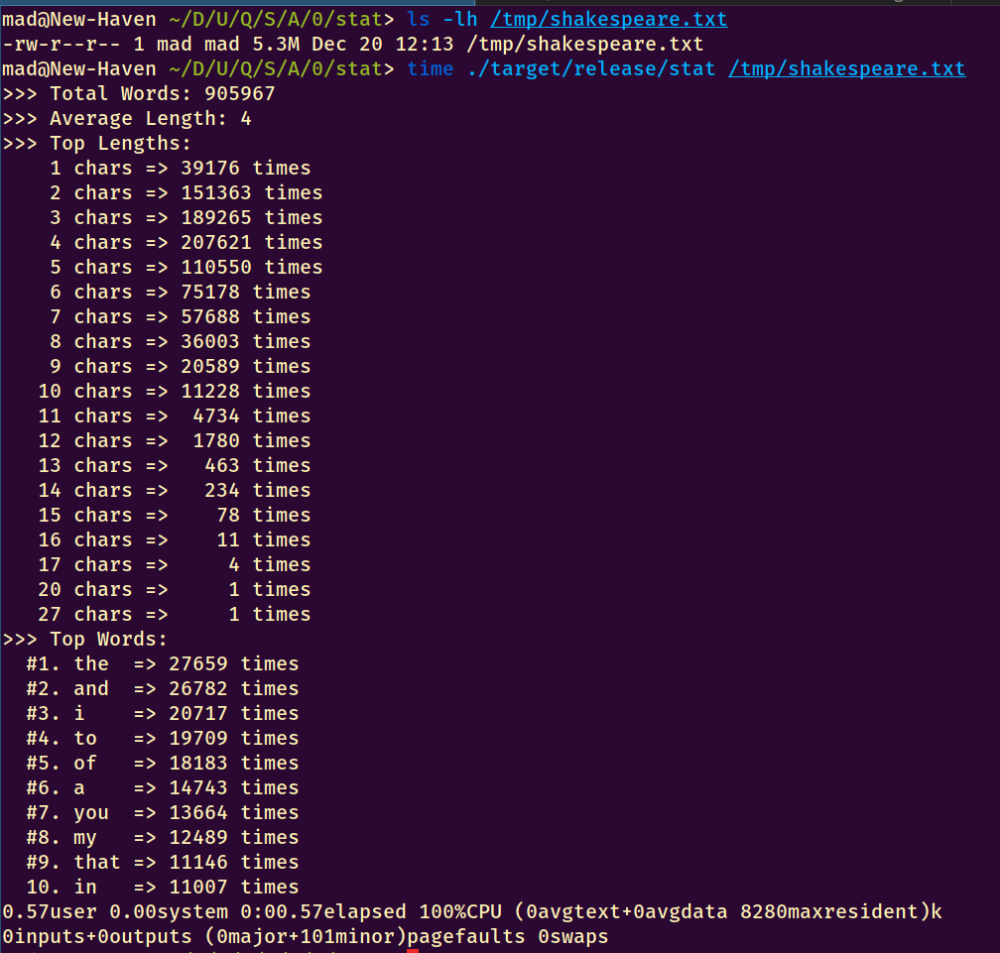
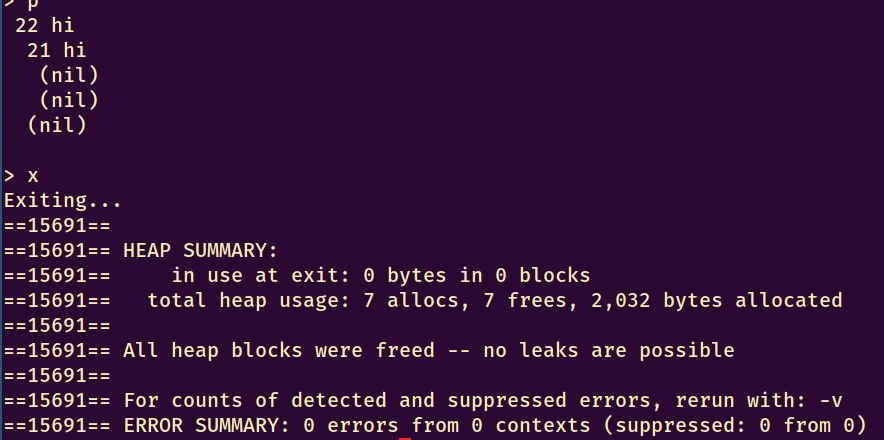

# Part B
## Approach
The program was developed in a script-like fashion, since it was very simple:

1. Checks for opening the file
2. Gathering data from the file
3. Printing this data to stdout

In order to improve efficiency, the program was designed from the start to make use of two hash tables.
These hash tables would generate intermediary data required to extract all required statistics in the fastest way possible.

An extensive use of Rust's collections and format capabilities improved readability a lot. 
Hash tables were turned into Vectors that could be efficiently parsed and operated with just a few instructions.
For example, the sorting of the statistics was only done at the end of the program, since keeping them into a sorted
data structure would not have improved performance.

## Results

In order to obtained the required data, the following scheme was implemented:

1. obtain dictionary mapping `d_words : word -> #words`
2. obtain dictionary mapping `d_lengths : len -> #words` from `d_words`
3. obtain total number of words from `d_lengths`
4. obtain average word length from `d_lengths`
5. obtain list of word lengths and their quantities from `d_words`
6. obtain $10$ most popular words from `d_lengths`

Not only does this approach improve flexibility by allowing to easily display new statistics from the dictionary mappings,
but it also improves efficiency by a considerable margin, due to hash table complexity for insertion operations.

To split correctly the sentences into words, and to remove special characters not part of a word, the crate `unicode_segmentation` was used.
While this does reduce efficiency compared to `str::split_whitespace()` (the crate uses a tree to index word delimiters), at the same time reliability
is gained when dealing with multiple languages or special character stripping.
This is because the crate is developed by a Mozilla employee (also the author of all major Unicode packages) and because it implements the official Unicode algorithm mentioned in their annex **UAX29**, so no uncertainty occurs when dealing with words and their boundaries.

It is important to notice that while this Unicode annex does specify word boundaries for many languages, it is unable to do so for the chinese language. This is because not always is it possible to immediatly recognize whether a grapheme is part of a longer word or a word itself.
In order to fix this issue, as mentioned by the crate author, some chinese applications implement a separate dictionary containing a chinese dictionary in order to look for words within the text.
I feel that this action is out of scope for this assignment, and did not go to such lengths.

   
## Reproducibility Statement
The `Cargo.toml` file contains all required information to normally compile and execute the program using `cargo`.

# Part C
## Approach
Due to lack of previous experience using Rust, the program was initially developed within the `main.rs` file and then split into a separate module for the sorted container library. The unit tests for the library were placed inside that file, as is norm in binary crates.

I started by making sure that the main structure of the program was correct, and then proceeded to implement the `struct`s for the sorted container and its nodes. I implemented the traits needed to easily develop some methods, and then moved onto the more difficult and recursive ones: `insert()`, `contains()`, and `erase()`.

### Valgrind
{height=250}

As can be seen, Rust provides strong safe guarantees after successful compilation and testing.
Were the program to execute some careless methods, even then the program would panic at runtime and exploits such as buffer or integer overflows would not be possible!

## Results
Inside the main program, some fixes needed to be made to the existing code base and the `unimplemented` macro had to be replaced.
The fixes were as follows:

1. The first item of the whitespace-split `input` was accessed directly. In rust, this results in a runtime panic when `input` is an empty string. In order to fix the issue, the existence of that item was checked before using it.
2. Age was not discarded for negative numbers, this was a specification that recently changed for the previous assignment using C.

As for the `sortedcontainer` module, the following steps were taken:
1. Derive _Debug_ and ordering traits for the node and tree structures, in order to ease development.
2. Implement _Display_ traits for the strcutures, in order to ease development. For the recursive structure, a helper function `fmt_rec()` was used.
3. Implement `new()` methods to ease development.
4. Implement `shallow_cmp()` in order to implement the `insert`, `contains`, and `erase`methods without using the deep comparison `cmp()` which was derived earlier.
5. Implement the main recursive functions, and add unit tests to each of them.

Recursion was used where possible, as suggested be done by the professor in the assignment document.

Checks using `cargo` resulted in code free of errors and successful tests.

## Reproducibility Statement
The `Cargo.toml` file contains all required information to normally compile, test, and execute the program using `cargo`.
Furthermore, valgrind was tested on the compiled executable using the flags `--leak-check=full --show-leak-kinds=all`.
